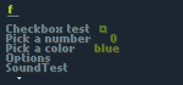
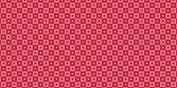

**djFlixel** v**0.5.0** *(2022-08)*  
**Author** : John32b  
**License** : MIT  
**Requires** : Haxe 4.2, HaxeFlixel 4.11  

# 🔦 What is it

**djFlixel** is a small library with some helpful tools for [HaxeFlixel](https://github.com/HaxeFlixel/flixel). It started as a helper for my personal projects. One of the first things that I implemented was a **menu system** and a **text autoscroller**. Then I kept adding things, like a tool to fade the screen to black, or a unified  keyboard/gamepad checker. Later on I decided to open source and distribute it, why not. 


The codebase is commented, and I hope that you may find it easy to use. Plus I made a **demo showcase app** that utilizes most of the parts of **djFlixel**; you can find the demo source files in the `/demo` folder.

**Checkout the HTML5 version of the DEMO here: https://john0032.itch.io/djflixel**


## Install

```sh
haxelib git djFlixel https://github.com/john32b/djFlixel
```


# 🧰 Main Features

## FlxMenu

  

A multi-page menu system. Best used for creating simple game menus. It's very simple to setup and use. Supports **links**, **checkboxes**, **list selection**, **number selection**. If offers a simple callback system to get events, like when an item was changed or focused. Also the visual style is customizable from the colors, fonts, animation times and offsets to custom cursors, etc.

---

## FlxAutotext

  

An autotype text object that supports a simple inline **tagging** system. Meaning that you can insert special tags in the source string that change the behavior on the fly, like adding pauses, triggering user callbacks or changing the character speed.

---

## FX Package

In the folder/package `djflixel/gfx` you can find some tools for creating various effects like static, rainbow loader, starfield, text sine scroller, text bouncer etc. All of the effects offer many customization options. Checkout the **DEMO**, it provides examples on how to use most of these.

|  |  |                  |
| ------------------------------------- | ----------------------------------------------- | ------------------------------------------------- |
|        |            |            |
|      |      |  |

  <sup>Some of the effects</sup>


## Global djFlixel Helper Object `D`

**djFlixel** offers the public static class `D.hx` for accessing some minor objects and helpers. It is available in the package `djFlixel.D`  

**What is included in `D`** :

- `D.ctrl` : Streamlined control polling. Check once and get gamepad/keyboard presses. Also able to change to change keyboard keymap on the fly
- `D.snd` : Offers some sound functions, like playing assets with only the short filename or setting predefined volumes for sounds
- `D.bmu` : General purpose **openFL** BitmapData Manipulation tools.
- `D.gfx`: **flixel/djFlixel** specific Bitmap Manipulation tools.
- `D.text` : Offers quick generation of `FlxText` objects with custom styles. Provides its own text styling struct. The entirety of **djFlixel** relies on this object to get and style text objects.
- `D.align` : Tools to align `FlxSprites`. Align in relation to the screen or to each other or in columns, etc
- `D.ui` : UI related helpers. Like an icon generator (built-in **djFlixel** icons)
- `D.save` : Save functions helper.
- `D.dest` : Helper object offering extra destroying functions, like tweens, or timers (*Use it like FlxDestroyUtil*)

---

## ⛓️ Other

There are other small tools in this libary. Like in the `djflixel/gfx/pal` package you will find some Color Palettes, like DB32. Or a class `DelayCall` which makes it easy to delay a function call. Feel free to explore the codebase and as always read the `demo/` source, which utilizes most of these.

### Icons

**djFlixel** has some built-in general use icons. Icons come in sized of `8,12,16,24` pixels wide and tall. Icons are accessible from the `D.ui` object. **Also**, as with any other white bitmap, you can use the bitmap tools in `D.bmu` to colorize these or apply shadows.

  

<!-- ```haxe
// Sprite icon of a heart colored red
var ic = new FlxSprite(D.bmu.replaceColor(D.ui.getIcon(16,'heart'),0xFFFFFFFF,0xFFFF0000));
``` -->

### Slice9 Tile mode Scaling 

In the tool `D.bmu` you can find a useful **slice9** scaler, that works by tile-repeating the inner parts, It generates `bitmapdata` objects so you can use it however you want.  

 

---

## 📄 Notes 

### Project status and future
Please note that this is just a side project of mine, I cannot guarantee any support or bugfixes. **This library is provided "as-is"**

###  Is there any documentation?
No. For a practical example checkout the `demo/` directory, it is an application that puts many of the components in use; it is heavily commented and I hope it explains things well. Also the library files themselves are commented. So feel free to dive into the codebase.  

> **❗ I have no plans to make a wiki or any other form documentation for this library.**


### Notes on some library source files

In the source files you will find two extra folders/namespaces `djA` and `djfl`.

- `djA` includes some target agnostic code. Code that can be used in all HAXE targets, like nodejs.
- `djfl` includes code that is specific to OpenFL.

Those are partial personal libraries that I use in some projects, but I'll probably never going to publish. So I did a copy paste of the specific files **djFlixel** uses and put them in a proper namespace folder structure, so **djFlixel** compiles.


### Issues?

- It seems to be that some fonts don't work well in **HTML5**, they appear to produce taller text objects than the other targets, and this throws off all the automatic positioning a bit. `FlxMenu` and `FlxAutotext` are affected. However I tried to implement a **hack/fix** for such cases. Readup on `MPageStyle` and `DTextStyle`, plus check the `demo/` sources for an application example.


<!-- ### Games using this library

Tomb Explorer : https://john0032.itch.io/tombexplorer  
Future Knight Remix : https://john0032.itch.io/futurek  
:exclamation: *If you have a program that uses this library, pm me and I'll add it here.*   -->

## ✏️ Changelog

**- V0.5 -- breaking changes from v0.4**
```text
- FlxMenu, changed way you declare pages and items
- FlxMenu bugfixes, and a new plugin system
- FlxAutotext, bugs fixed
- FlxMenu, changed the way styles are processed/stored. Styles are more unified now
- D.snd breaking changes, there is a new better way to declare sound assets
- StaticNoise is now working in HTML5
- D.assets, rewrite and partially depracating it
- NEW: FlxToast, brought back from v0.3
- DelayedCall, changed init parameter order
- D.text HTML5 tall font hack-fix
- Refactored code in MItemData, it is way better now
- Updated the DEMO
- General code cleanup, and more that smaller things I don't remember
```

## 📮 Closing

I started creating this library in 2015-2016, recently I reseted the commit history to a fresh start. The older versions prior to 0.4 are available in the TAG releases here on GitHub.

Thanks for checking this out 😸,  
John.
